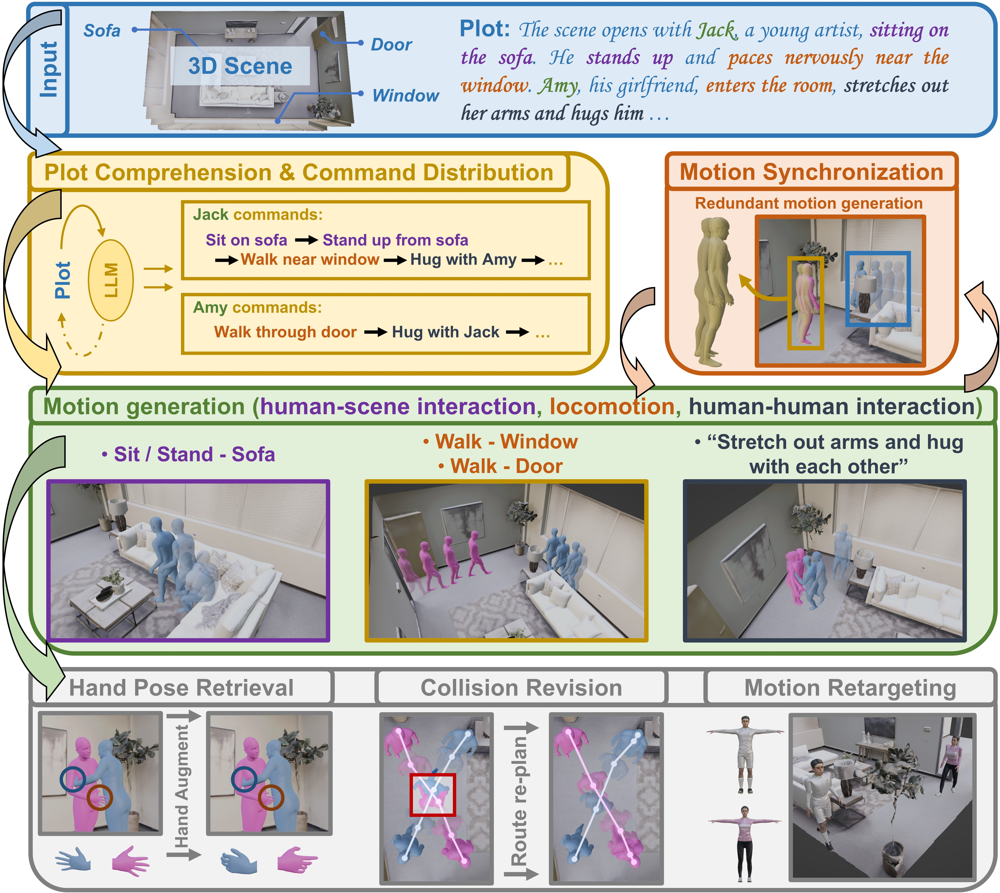

<div align="center">

<h1><a href="https://arxiv.org/abs/2410.10790">Sitcom-Crafter: A Plot-Driven Human Motion Generation System in 3D Scenes</a></h1>

**[Jianqi Chen](https://windvchen.github.io/), [Panwen Hu](https://www.linkedin.com/in/panwenhu-profile/en?originalSubdomain=ae), [Xiaojun Chang](https://scholar.google.com/citations?user=8suupocAAAAJ&hl=en), [Zhenwei Shi](https://scholar.google.com.sg/citations?user=kNhFWQIAAAAJ&hl=en), [Michael Christian Kampffmeyer](https://scholar.google.no/citations?user=9lDh2UgAAAAJ&hl=en), and [Xiaodan Liang](https://scholar.google.com/citations?user=voxznZAAAAAJ&hl=en)**


[](#License)
[](https://arxiv.org/abs/2410.10790)
<a href='https://windvchen.github.io/Sitcom-Crafter/'>
  </a>

</div>

### Share us a :star: if this repo does help

This repository is the official implementation of *Sitcom-Crafter*. If you encounter any question, please feel free to contact us. You can create an issue or just send email to me windvchen@gmail.com. Also welcome for any idea exchange and discussion.

## Updates

[**10/15/2024**] Code public.

[**10/05/2024**] Code cleanup done. Waiting to be made public.

[**09/29/2024**] Code init.


## Table of Contents

- [Abstract](#Abstract)
- [Requirements](#Requirements)
- [Pretrained Weights Release](#Pretrained-Weights-Release)
- [Data Preparation](#Data-Preparation)
   - [InterHuman Data Preparation](#InterHuman-Data-Preparation)
   - [Inter-X Data Preparation](#Inter-X-Data-Preparation)
   - [Human Interaction Data visualization](#Human-Interaction-Data-visualization)
   - [Others](#Others)
      - [Calculate the std and mean of the human-human interaction](#Calculate-the-std-and-mean-of-the-human-human-interaction)
      - [Clip Embeddings Extraction](#Clip-Embeddings-Extraction)
      - [3D Replica Scene Data Preparation](#3D-Replica-Scene-Data-Preparation)
      - [SMPL/SMPLH/SMPLX Model Preparation](#SMPLSMPLHSMPLX-Model-Preparation)
      - [Essentials for Human-Human Penetration Loss Preparation](#Essentials-for-Human-Human-Penetration-Loss-Preparation)
      - [Human locomotion and human-scene interaction pretrained weights and configurations](#human-locomotiona-and-human-scene-interaction-pretrained-weights-and-configurations)
- [Body Regressor](#Body-Regressor)
   - [Body Regressor Training](#Body-Regressor-Training)
   - [Body Regressor Evaluation & Visualization](#Body-Regressor-Evaluation--Visualization)
- [Human-Human Interaction Module](#Human-Human-Interaction-Module)
   - [Human-human interaction module training](#Human-human-interaction-module-training)
   - [Human-human interaction module evaluation](#Human-human-interaction-module-evaluation)
   - [Human-human interaction module generation and visualization](#Human-human-interaction-module-generation-and-visualization)
- [Full System Generation](#Full-System-Generation)
   - [Plot-driven human motion generation](#Plot-driven-human-motion-generation)
   - [Plot-driven human motion generation evaluation](#Plot-driven-human-motion-generation-evaluation)
   - [Plot-driven human motion generation Visualization (Blender)](#Plot-driven-human-motion-generation-Visualization-Blender)
- [Results](#Results)
- [Citation & Acknowledgments](#Citation--Acknowledgments)


## Abstract



Recent advancements in human motion synthesis have focused on specific types of motions, such as human-scene interaction, locomotion or human-human interaction, however, there is a lack of a unified system capable of generating a diverse combination of motion types. In response, we introduce ***Sitcom-Crafter***, **a comprehensive and extendable system for human motion generation in 3D space**, which can be **guided by extensive plot contexts** to enhance workflow efficiency for anime and game designers. The system is comprised of eight modules, three of which are dedicated to motion generation, while the remaining five are augmentation modules that ensure consistent fusion of motion sequences and system functionality. Central to the generation modules is our novel 3D scene-aware human-human interaction module, which addresses collision issues by synthesizing implicit 3D Signed Distance Function (SDF) points around motion spaces, thereby minimizing human-scene collisions without additional data collection costs. Complementing this, our locomotion and human-scene interaction modules leverage existing methods to enrich the system's motion generation capabilities. Augmentation modules encompass plot comprehension for command generation, motion synchronization for seamless integration of different motion types, hand pose retrieval to enhance motion realism, motion collision revision to prevent human collisions, and 3D retargeting to ensure visual fidelity. Experimental evaluations validate the system's ability to generate high-quality, diverse, and physically realistic motions, underscoring its potential for advancing creative workflows. 

## Requirements

1. Hardware Requirements
    - GPU: For training, more GPUs are preferred. For evaluation, a single GPU with about 12GB should be sufficient.

2. Software Requirements
    - Python: 3.10 or above
    - CUDA: 11.8 or above
    - cuDNN: 8.4.1 or above

   To install other requirements:

   ```
   pip install -r requirements.txt
   ```

   Please install `human_body_prior` package from the [official website](https://github.com/nghorbani/human_body_prior), as the package version is outdated in the PyPI repository.

   (You may encounter some issues when installing the `pointnet2_ops` and `pytorch3d` packages. If so, please compile the `pointnet2_ops` and `pytorch3d` packages manually according to their official instructions.)

## Pretrained Weights Release

In this part, we provide the pretrained weights of our system. You can download them from the following links:

- Body Regressor (Remember to modify `get_smplh_body_regressor_checkpoint_path()` and `get_smplx_body_regressor_checkpoint_path()` in [global_path.py](HHInter/global_path.py) to the downloaded paths). Please refer to the [Body Regressor Training](#Body-Regressor-Training) section for training details if you want to train your own models:
   - [Marker2SMPLH](https://drive.google.com/file/d/1dBdHltzwmz6DP4DnxSN23Md_Z7M2cLtr/view?usp=sharing)
   - [Marker2SMPLX](https://drive.google.com/file/d/1kxWXiBjDhCsP1xnPKttLoWXKuH4zIYO8/view?usp=sharing)

- Human-Human Interaction Module (Remember to modify `model.yaml` (evaluation/generation) or `train.yaml` (finetuning) in [configs](HHInter/configs) to the downloaded paths). Here we only provide the weights trained on the 30-FPS InterHuman dataset. Please refer to the [Human-human interaction module training](#Human-human-interaction-module-training) section for training details if you want to train other kinds of models:
   - [Model Checkpoint of Phase 1](https://drive.google.com/file/d/1sXRTEQfDVcsQXxMqp1piAdUqaIj68BbC/view?usp=sharing)
   - [Model Checkpoint of Phase 1 & 2](https://drive.google.com/file/d/1SrAqv8afMQPLKjwP65L295-tzdmwE-2n/view?usp=sharing)
   - [Model Checkpoint of Phase 1 & 2 & 3](https://drive.google.com/file/d/1ROQoMy3AtCdutDjNAHB488xObLB4V9Sa/view?usp=sharing)

## Data Preparation

**Note:** [Before any training, evaluation, or visualization, please ensure you have modified the global parameters in [global_path.py](HHInter/global_path.py) to your own paths first.]

### InterHuman Data Preparation

First, download the InterHuman dataset from the [official website](https://github.com/tr3e/InterGen?tab=readme-ov-file) and save it in the `get_dataset_path()` path which is set in [global_path.py](HHInter/global_path.py). Then, run the following command to convert the raw InterHuman dataset to the marker-point InterHuman dataset that can be used in our system:

```
cd HHInter
python rearrange_dataset.py
```
You can modify the `OUT_FPS` parameter in the [rearrange_dataset.py](HHInter/rearrange_dataset.py) file to control the output frame rate of the dataset.

(Optional) The above command is used to process the raw `motions` in the original InterHuman dataset. If you want to directly convert the 30-FPS `motions_processed` of the InterHuman dataset to the marker-point InterHuman dataset, you can run the following command:

```
cd HHInter
python intergen_processed_to_custom.py
```

### Inter-X Data Preparation

First, download the Inter-X dataset from the [official website](https://github.com/liangxuy/Inter-X) and save it in the `get_dataset_path()` path which is set in [global_path.py](HHInter/global_path.py). Then, run the following command to convert the raw Inter-X dataset to the marker-point Inter-X dataset that can be used in our system:

```
cd HHInter
python rearrange_dataset_interX.py
```
You can modify the `OUT_FPS` parameter in the [rearrange_dataset_interX.py](HHInter/rearrange_dataset_interX.py) file to control the output frame rate of the dataset.

### Human Interaction Data Visualization

We provide a comprehensive visualization tool for different kinds of datasets (the raw InterHuman dataset, the converted marker-point InterHuman dataset, the raw Inter-X dataset, and the converted marker-point Inter-X dataset, etc.). To visualize the data, run this command:

```
cd HHInter
python custom_visualize.py
```
Please check more details of functions and usages in the [custom_visualize.py](HHInter/custom_visualize.py) file.

### Others

#### Calculate the std and mean of the human-human interaction dataset

To calculate the mean and std of the dataset which is used for normalization in the training, run this command:

```
cd HHInter
python cal_dataset_std_mean.py
```

#### Clip Embeddings Extraction

To pre-extract the clip embeddings for the Hand Pose Retrieval module, run this command:

```
cd HHInter
python clip_embedding_extraction.py
```

#### 3D Replica Scene Data Preparation

Download the 3D Replica Scene dataset from the [official website](https://github.com/facebookresearch/Replica-Dataset) and save it in the `HSInter\data` path. (Note that our system currently only supports one-layer scenes. If want to use multi-layer scenes, please modify the code accordingly.)

#### SMPL/SMPLH/SMPLX Model Preparation

Download the SMPL/SMPLH/SMPLX model from the their [official website-SMPL](https://smpl.is.tue.mpg.de/) / [official website-SMPLH](https://mano.is.tue.mpg.de/) / [official website-SMPLX](https://smpl-x.is.tue.mpg.de/) and save them in the `get_SMPL_SMPLH_SMPLX_body_model_path()` path which is set in [global_path.py](HHInter/global_path.py).

For the SMPLX models, please also copy them to the path `HSInter\data\models_smplx_v1_1\models\smplx`.

#### Essentials for Human-Human Penetration Loss Preparation

Download the essentials for Human-Human Penetration Loss from the [official website](https://drive.google.com/uc?id=16eYddIxKPaZU-PjrH1x0Fgsen-x0ip3f) provided by [BUDDI](https://github.com/muelea/buddi) and save them in the `HHInter\data`.

#### Human locomotion and human-scene interaction pretrained weights and configurations

Download the pretrained weights and configurations of the human locomotion and human-scene interaction modules from the [official website](https://drive.google.com/drive/folders/1AvM4GvdkG1OkggaQnggNeGmt2xgipKRU) by [DIMOS](https://github.com/zkf1997/DIMOS) and save them in the `HSInter\` path (force overrides if there are conflicts). You also need to configure PROX-S into the `HSInter\data` path as mentioned in the [official website](https://github.com/zkf1997/COINS?tab=readme-ov-file#prox-s-dataset), and have the [COINS checkpoints](https://drive.google.com/drive/folders/1dKcFuWdR4QxciIuYclIVBenVepGRj4Oh) in the `HSInter\coins\checkpoints` path.

## Body Regressor

**Note:** [Before any training, evaluation, or visualization, please ensure you have modified the global parameters in [global_path.py](HHInter/global_path.py) to your own paths first.]

### Body Regressor Training

To train the body regressors **Marker2SMPLH** or **Marker2SMPLX** which convert the marker points to the SMPLH/SMPLX model parameters, run this command:

```
python marker_regressor/exp_GAMMAPrimitive/train_GAMMARegressor.py --cfg MoshRegressor_v3_neutral_new
```
Please modify the parameters `marker_filepath`, `body_model_path`, and `dataset_path` in the configuration file [MoshRegressor_v3_neutral_new.yaml](marker_regressor/exp_GAMMAPrimitive/cfg/MoshRegressor_v3_neutral_new.yml) to your own paths. By setting `is_train_smplx` to `True`, you can train the **Marker2SMPLX** model, otherwise, the **Marker2SMPLH** model will be trained. The results will be saved in the directory `marker_regressor/results`.

### Body Regressor Evaluation & Visualization

To evaluate / visualization the body regressors, run this command:

```
python marker_regressor/exp_GAMMAPrimitive/infer_GAMMARegressor.py --cfg MoshRegressor_v3_neutral_new --checkpoint_path <checkpoint path>
```
Please modify the parameters `marker_filepath`, `body_model_path`, and `dataset_path` in the configuration file [MoshRegressor_v3_neutral_new.yaml](marker_regressor/exp_GAMMAPrimitive/cfg/MoshRegressor_v3_neutral_new.yml) to your own paths. The `checkpoint_path` should be set to the path of the trained model. Also ensure the `is_train_smplx` is consistent with the trained model type.

## Human-Human Interaction Module

**Note:** [Before any training, evaluation, or visualization, please ensure you have modified the global parameters in [global_path.py](HHInter/global_path.py) to your own paths first.]

### Human-human interaction module training

To train the human-human interaction module, run this command:

```
cd HHInter
python train.py
```
Please modify the parameters `DATA_ROOT` and `DATA_INTERX_ROOT` under `interhuman`, `interhuman_val`, and `interhuman_test` in the dataset configuration file [datasets.yaml](HHInter/configs/datasets.yaml) to your own paths. If you want to additionally train on Inter-X dataset, please set `USE_INTERX` to `True`.

Please also modify the parameters in [model.yaml](HHInter/configs/model.yaml) according to your needs。 You can use `CHECKPOINT` to load a pretrained model (note that this is only for evaluation. For training finetuning, please use `RESUME` parameter as mentioned below), otherwise just leave it empty. Use `TRAIN_PHASE_TWO` to train the model in the second phase. Use `USE_VERTEX_PENETRATION` to use human-human body penetration loss in the training (note that this will require more memory, thus also need to modify batch size below together). The settings of the three training phases are as follows: Phase 1: `TRAIN_PHASE_TWO` is `False`, `USE_VERTEX_PENETRATION` is `False`; Phase 2: `TRAIN_PHASE_TWO` is `True`, `USE_VERTEX_PENETRATION` is `False`; Phase 3: `TRAIN_PHASE_TWO` is `True`, `USE_VERTEX_PENETRATION` is `True`.

Please also modify the parameters in [train.yaml](HHInter/configs/train.yaml) according to your needs. You can use `BATCH_SIZE` to control the batch size in the training. and also other parameters like `LR` (learning rate), `EPOCH`, `SAVE_EPOCH` (save every N epochs), and also `RESUME` (set it to a checkpoint path to finetune a model, or just leave it empty). The results will be saved in the directory `CHECKPOINT` with the name `EXP_NAME`.

### Human-human interaction module evaluation

To evaluate the human-human interaction module, run this command:

```
cd HHInter
python eval.py
```
Please modify the parameters `DATA_ROOT` and `DATA_INTERX_ROOT` under `interhuman`, `interhuman_val`, and `interhuman_test` in the dataset configuration file [datasets.yaml](HHInter/configs/datasets.yaml) to your own paths.

Please also modify the parameters in [model.yaml](HHInter/configs/model.yaml) to set `CHECKPOINT` to load a pretrained model for evaluation. The result is a .log file in the local directory.

### Human-human interaction module generation and visualization

To generate and visualize the human-human interaction module, run this command:

```
cd HHInter
python infer.py
```
Please modify the parameters `DATA_ROOT` and `DATA_INTERX_ROOT` under `interhuman`, `interhuman_val`, and `interhuman_test` in the dataset configuration file [datasets.yaml](HHInter/configs/datasets.yaml) to your own paths.

Please also modify the parameters in [model.yaml](HHInter/configs/model.yaml) to set `CHECKPOINT` to load a pretrained model for generation. The results are saved in a directory named `results-<CHECKPOINT-NAME>` in the local directory.

We support Video Recording, OnScreen / OffScreen rendering, generation based on a prompt.txt file / test dataset. etc. You can check details in the [infer.py](HHInter/infer.py) file.

## Full System Generation

### Plot-driven human motion generation

To craft adversarial examples, run this command:

```
cd HSInter
python synthesize/demo_hsi_auto.py
```
Please ensure you have set up the pretrained human-human interaction model path in the [global_path.py](HSInter/global_path.py) file. Modify `save_path_name` in the [demo_hsi_auto.py](HSInter/synthesize/demo_hsi_auto.py) file to your desired save path. If you want to input your own plot but not use the LLM generated one, please comment out the codes within the `Automatically LLM plot & order generation` scope in the `run()` function, and uncomment the codes within the `Manually define the motion orders` scope.

### Plot-driven human motion generation evaluation

To evaluate the plot-driven human motion generation, run this command:

```
cd HHInter
python eval-long-story.py
```
Please change the `pickle_file_root` in the file to the path of the generated motion sequences. The result is a .log file in the local directory.

### Plot-driven human motion generation visualization (Blender)

To visualize the generated motion sequences (**without 3D retargeting**) in Blender, please refer to the [import_primitive.py](HSInter/visualization/import_primitive.py) file and run it in Blender Python Console with necessary modifications of the paths.

To visualize the generated motion sequences (**with 3D retargeting**) in Blender, please refer to the [blendershow.py](HSInter/visualization/blendershow.py) file and run it in Blender Python Console with necessary modifications of the paths.

## Results

<div align=center></div>
<div align=center></div>


## Citation & Acknowledgments
If you find this paper useful in your research, please consider citing:
```
@article{chen2024sitcomcrafterplotdrivenhumanmotion,
  title={Sitcom-Crafter: A Plot-Driven Human Motion Generation System in 3D Scenes},
  author={Chen, Jianqi and Hu, Panwen and Chang, Xiaojun and Shi, Zhenwei and Kampffmeyer, Michael and Liang, Xiaodan},
  journal={arXiv preprint arXiv:2410.10790},
  year={2024}
}
```

Also thanks for the open source code of [InterGen](https://github.com/tr3e/InterGen), [DIMOS](https://github.com/zkf1997/DIMOS), [GAMMA](https://github.com/yz-cnsdqz/GAMMA-release), [BUDDI](https://github.com/muelea/buddi). Some of our codes are based on them.

## License
This project is licensed under the Apache-2.0 license. See [LICENSE](LICENSE) for details.
